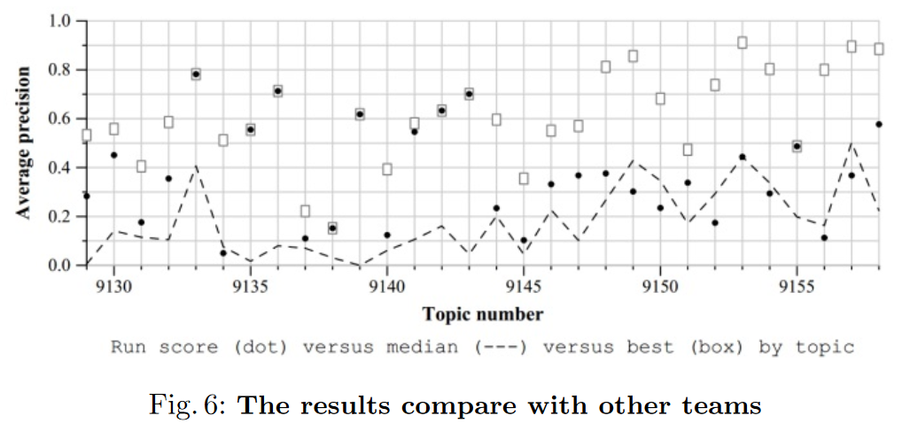

# TRECVID2015

- query adaptive 的matlab函数，C实现：adap64\adap64
- 车辆检测算法：MtVehcile
- 颜色过滤算法：NewColor
- RANSAC的matlab函数，C++实现：tv15x64\mexRANSAC

## 关于比赛
> The [TREC](http://trec.nist.gov/) conference series is sponsored by the National 
> Institute of Standards and Technology ([NIST](http://trec.nist.gov/)) with additional 
> support from other U.S. government agencies.In 2001 and 2002 the 
> TREC series sponsored a video "track" devoted to research in automatic 
> segmentation, indexing, and content-based retrieval of digital video. 
> Beginning in 2003, this track became an independent evaluation ([TRECVID](http://www-nlpir.nist.gov/projects/trecvid/)) 
> with a workshop taking place just before TREC. 

INS子比赛的总结报告[slides](http://www-nlpir.nist.gov/projects/tvpubs/tv15.slides/tv15.ins.slides.pdf)

## 技术报告
[nercms.pdf](http://www-nlpir.nist.gov/projects/tvpubs/tv15.papers/nercms.pdf)

## 结果

----
实验室@[NERCMS](http://multimedia.whu.edu.cn/)